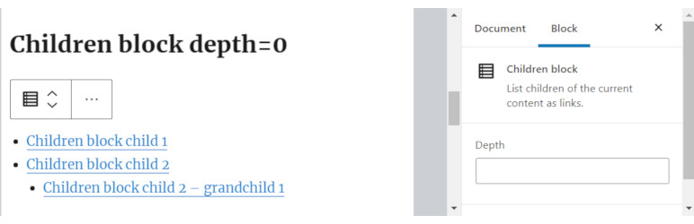

# SB Children block 

* Contributors:      bobbingwide
* Tags:              block, children, links, offspring, descendents, descendants
* Requires at least: 5.4.2
* Tested up to:      6.4-RC1
* Stable tag:        1.2.3
* Requires PHP:      7.2.0
* License:           GPL-2.0-or-later
* License URI:       https://www.gnu.org/licenses/gpl-2.0.html

List children of the current content as links.

## Description 
Use the Children block ( oik-sb/children ) to list children of the current content as links.
Works for any hierarchical post type which supports page-attributes, such as page.

## Installation 

1. Upload the plugin files to the `/wp-content/plugins/sb-children-block` directory, or install the plugin through the WordPress plugins screen directly.
1. Activate the plugin through the 'Plugins' screen in WordPress

OR

With the authority to install plugins:

1. In the block editor, open the block inserter.
1. Search for the block by typing 'Children'.
1. Click on the 'Add block' button for the SB Children block.
1. The SB Children block plugin will be installed and activated.
1. And the block will be inserted into your content.

## Frequently Asked Questions 

# What are the values for the depth parameter? 

- Value - Meaning
- 0 - Display all descendents in a tree
- 1 - Display Children only
- 2 - Display Children and Grandchildren
- n - Display n levels of descendents
- -1 - Display all descendents in a single list

# What do I need to search for to find the block? 
* You can try typing the following strings to find the block: c, ch, chi, chil, child, childr, childre and children.
* You may also get results by typing the keywords: Child list, Descendents and Tree.

# What if my first language is not English? 

If your first language is not English then you could try:

- French - enfants
- German - Kinder
- Dutch - Kinderen
- Italian - la prole
- Spanish - niñas or niños

# Do I need to build this block? 
No. The plugin is delivered with the production version of the block.
If you do wish to modify the code then you can find instructions in the src folder.

## Screenshots 
1. Children block depth=0
2. Children block depth=1
3. Children block depth=2
4. Children block depth=-1

## Upgrade Notice 
# 1.2.3 
Upgrade for support for PHP 8.1 and PHP 8.2. Tested with WordPress 6.4-RC1 and Gutenberg 16.8.1

## Changelog 
# 1.2.3 
* Changed: Support PHP 8.1 and PHP 8.2 #23
* Tested: With WordPress 6.4-RC1 and WordPress Multisite
* Tested: With Gutenberg 16.8.1
* Tested: With PHP 8.0, PHP 8.1 and PHP 8.2
* Tested: With PHPUnit 9.6
